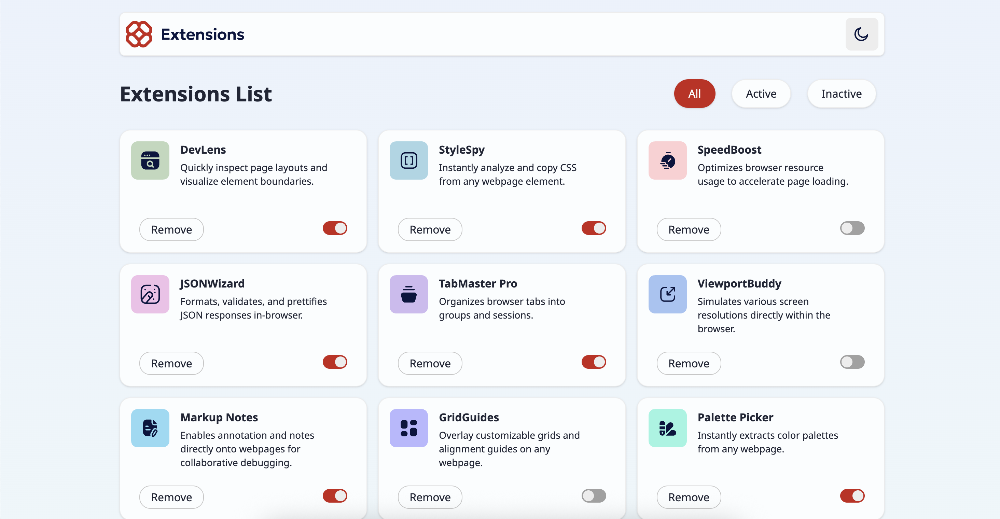

# Browser extensions manager UI

This project is a UI for a browser extensions manager. It's built using React and TypeScript, and it utilizes the Vite build tool, Tailwind CSS for styling, and ESLint for linting.

## Table of contents

- [Overview](#overview)
  - [The challenge](#the-challenge)
  - [Screenshot](#screenshot)
  - [Links](#links)
- [Built with](#built-with)
- [Author](#author)

## Overview

### The challenge

Users should be able to:

- Toggle extensions between active and inactive states
- Filter active and inactive extensions
- Remove extensions from the list
- Select their color theme
- View the optimal layout for the interface depending on their device's screen size
- See hover and focus states for all interactive elements on the page

### Screenshot

### Links

- Live Site URL: [https://browser-extensions-manager-eight.vercel.app/](https://browser-extensions-manager-eight.vercel.app/)

## Built with

- Semantic HTML5 markup
- Mobile-first workflow
- Flexbox
- [TypeScript](https://www.typescriptlang.org/) - Strongly typed javascript
- [TailwindCSS](https://https://tailwindcss.com/) - For styles
- [React](https://reactjs.org/) - JS framework

## Author

- Website - [Add website](https://www.your-site.com)
- Linkedin - [Gabriel Marcano](https://www.linkedin.com/in/gabriel-e-marcano/)

This is a solution to the [Browser extensions manager UI challenge on Frontend Mentor](https://www.frontendmentor.io/challenges/browser-extension-manager-ui-yNZnOfsMAp).
